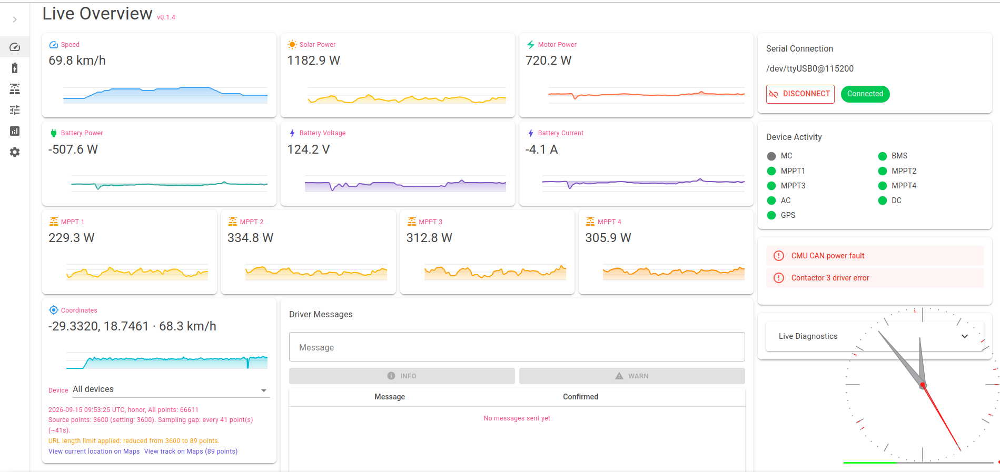
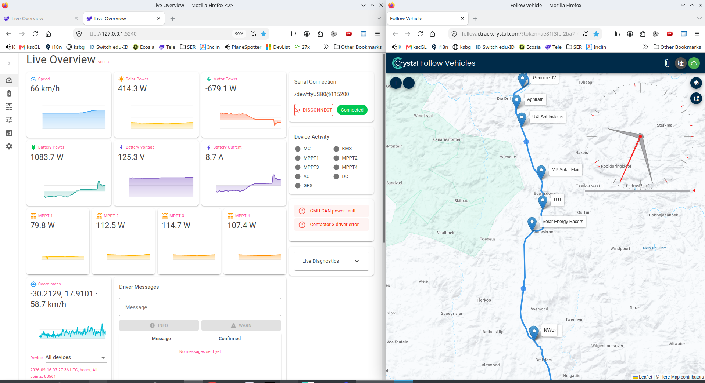
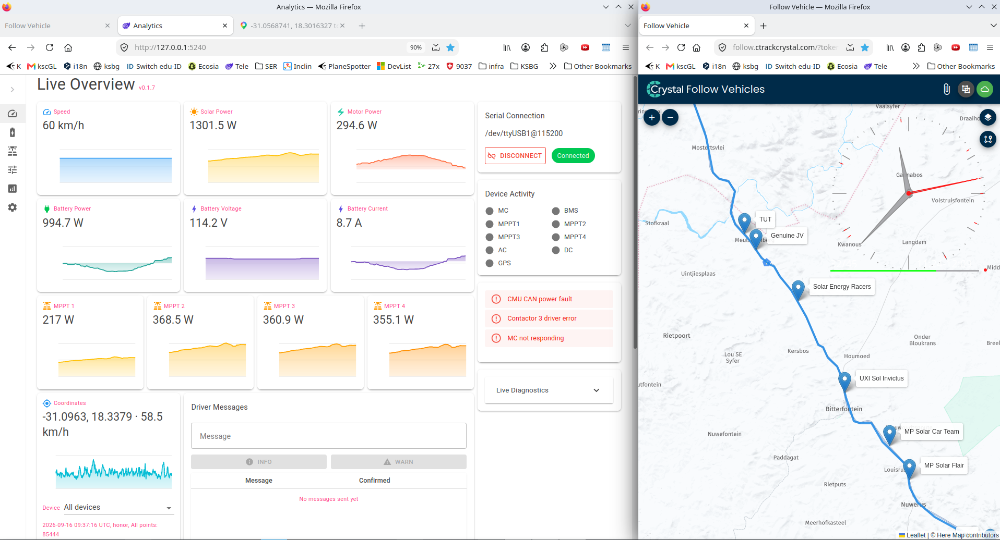
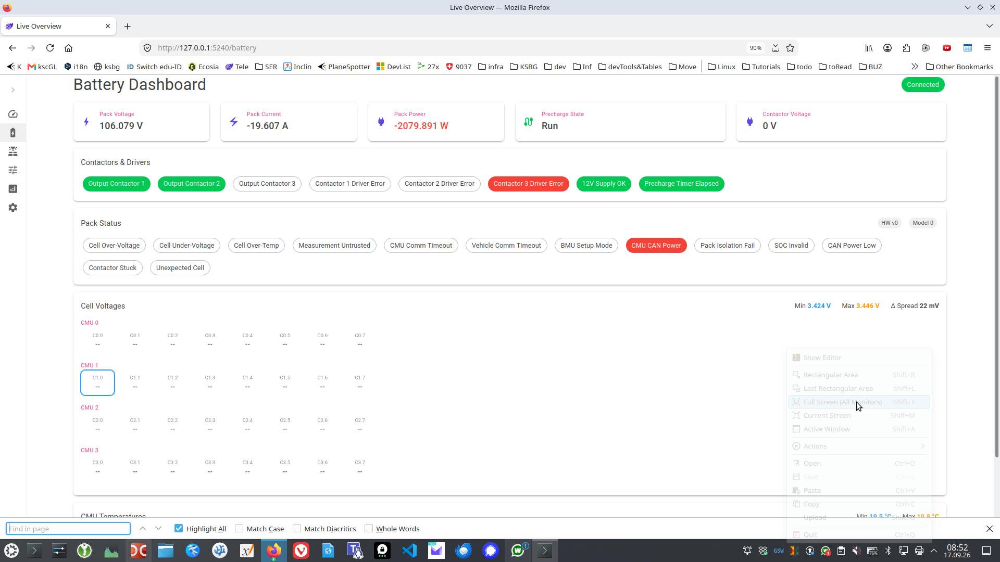
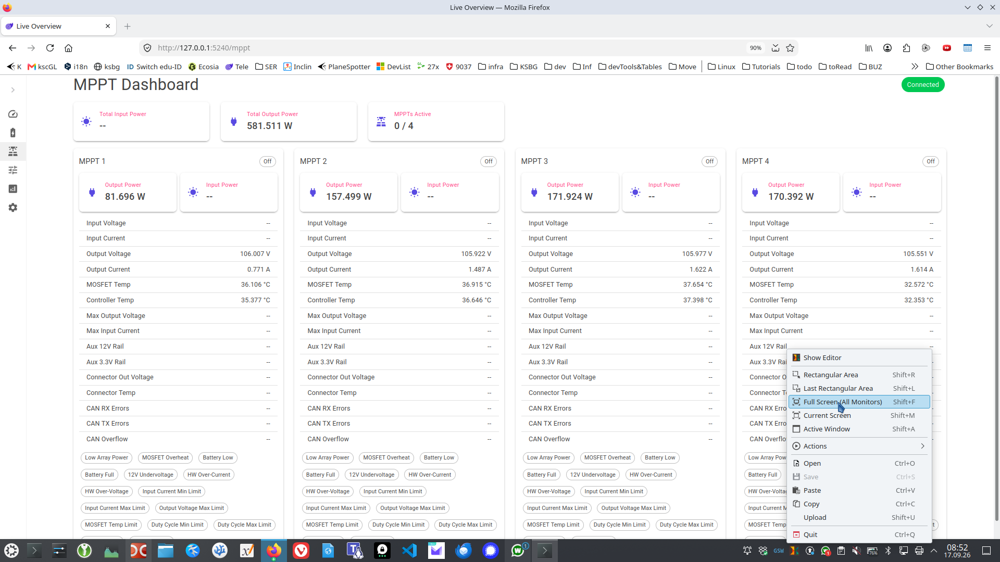
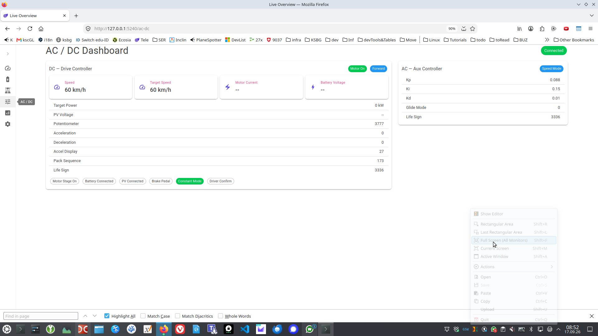
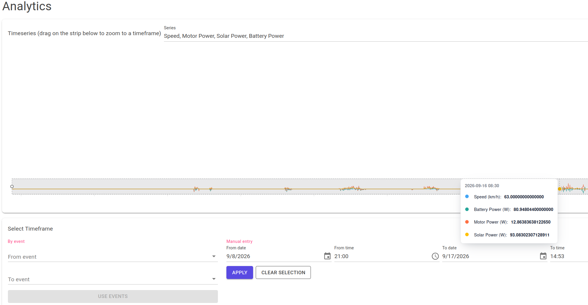

# SERLiveMonitoring - User Manual

SERLiveMonitoring is a browser-based dashboard for monitoring a solar-powered race car live, over
a serial connection to the car's CAN bus. Once the app is running (see
[deployment_manual.md](deployment_manual.md)), open it in a browser at the address printed at
startup (typically `http://localhost:5240`, or `http://<host machine's LAN IP>:5240` from another
device on the same network).

The navigation drawer on the left links to six pages: **Live Overview**, **Battery**, **MPPT**,
**AC / DC**, **Analytics** and **Settings**. Use the arrow icon at the top of the drawer to
collapse/expand it.

## Connecting to the car

Live data only appears once the app is connected to the car's CAN interface over a serial port.
On the **Live Overview** page, under "Serial Connection":

1. Pick the serial port the CAN interface is attached to from the dropdown. Use the refresh icon if
  a newly-plugged-in device does not show up.
2. Set the baud rate to match the interface. Available values are 9600, 19200, 38400, 57600, and
  115200; the default is 115200.
3. Click **Connect**. The status chip (also shown on the Battery/MPPT/AC-DC pages) turns green
   once connected.
4. Click **Disconnect** to stop reading, e.g. before unplugging the interface.

If the connection drops or the car stops sending data, tiles keep showing the last known values.
Check the status chip, Device Activity indicators, Live Diagnostics, and the "Device communication
timeout" warning (see Settings below) to distinguish stale data from a live feed.

## Live Overview (`/`)

The main dashboard, shown once connected:

- **Stat tiles** - speed, battery, motor and per-MPPT power tiles, each with a small spark chart
  of recent history.
- **Coordinates tile** - the latest GPS fix, with an All devices/device selector when more than one
  GPS-reporting device has sent data (see the [API manual](api_manual.md) for how a device
  reports its position), links to view the current location or recent track on Google Maps.
- **Driver Messages** - send a short **Info** or **Warn** message to the car's dashboard display;
  the table below shows sent messages and whether/when the driver confirmed them.
- **Serial Connection** panel - see "Connecting to the car" above.
- Warnings (voltage spread, over-temperature, MPPT underperformance, communication timeout, etc.)
  are evaluated against the thresholds on the Settings page and surfaced here.

*Live Overview dashboard.*

*Live Overview with track data at 09:28.*

*Live Overview with track data at 11:53.*

## Battery (`/battery`)

Pack-level battery telemetry: pack voltage/current/power, precharge state, contactor voltage, and
the state of each contactor/driver flag reported by the BMS.

*Battery dashboard.*

## MPPT (`/mppt`)

Total solar input/output power and how many MPPTs are currently active, plus a card per MPPT
channel with its individual input/output power and on/off state.

*MPPT dashboard.*

## AC / DC (`/ac-dc`)

Drive controller (DC) telemetry - speed, target speed, motor current, battery voltage, motor
on/off state and direction - alongside detailed rows of additional DC channel data.

*AC/DC dashboard.*

## Analytics (`/analytics`)

Historical analysis over a selected timeframe, independent of whether the car is currently
connected (it reads from previously recorded/persisted history):

- **Timeseries chart** - pick one or more series (speed, battery voltage/current/power,
  motor power, total solar power, or an individual MPPT) to plot; drag on the chart to select a
  timeframe directly. The chart also shows an integrated distance trace.
- **Select Timeframe** - alternatively, pick a `From event`/`To event` pair (see event timestamps
  below) and click **Use Events**, or enter an exact from/to date and time manually and click
  **Apply**. **Clear Selection** resets it.
- Once a timeframe is selected, summary tiles show distance, motor energy consumed/regenerated,
  solar energy generated, net energy delta, average energy per km and average motor power for that
  window. The energy values are calculated from the recorded one-second samples; a window with no
  history has no summary.
- **Refresh Data** reloads the underlying history (e.g. after new data has been recorded). Long
  timeframes are downsampled for display, while summary calculations use the underlying samples.

*Analytics page.*

For programmatic/bulk access to the same historical data (CSV or JSON), see the
[API manual](api_manual.md).

## Settings (`/settings`)

Configuration that applies immediately, without restarting the app, and is saved to disk and
restored the next time the app starts:

- **CAN Bus Addresses** - the base CAN address (hex, 0x000-0x7FF) for each device (MPPTs 1-4, BMS,
  AC, DC, motor controller). Change these if the car's CAN wiring/firmware uses non-default
  addresses.
- **Warning Thresholds** - limits that trigger the warnings shown on Live Overview: max battery
  cell voltage spread/temperature, max motor/MPPT temperature, minimum active MPPT power (below
  which a panel is treated as idle rather than underperforming), low MPPT power ratio (relative to
  other active panels), and the device communication timeout.
- **General** - tile average window (1 second to 1 hour), number of GPS source points used when
  building a Google Maps track link, the **No MC CAN Data** option, and the color theme (Dark,
  Light, or Solarized). Enable No MC CAN Data when the motor controller does not send current or
  power over CAN; motor current and power are then derived from battery current and total MPPT
  output current. No restart is needed after saving.
- **Chart Scale Limits** - minimum, maximum, and optimal-range values used by the dashboard and
  analytics charts for speed, solar power, motor power, battery power, battery voltage, battery
  current, and MPPT power. Each minimum must not exceed its maximum, and each optimal minimum must
  not exceed its optimal maximum.

Select **Save** to apply and persist changes. **Reset to Defaults** restores the default values in
the form; save afterward if you want those defaults written to disk. Invalid CAN addresses must be
hexadecimal values from `0x000` through `0x7FF`.

## Data and recovery

Timeseries, GPS fixes, and event timestamps are restored automatically when the app starts. Event
timestamps can be created on Live Overview with **Now** or **Custom Time…**, selected as the bounds
of an Analytics query, and deleted from the event list. GPS data is supplied by the HTTP API; see
the [API manual](api_manual.md).

When moving or upgrading a deployment, preserve both the configured datastore directory and the
operating-system settings file if you need to retain recorded history and UI/device settings. See
the [deployment manual](deployment_manual.md) for their locations.
